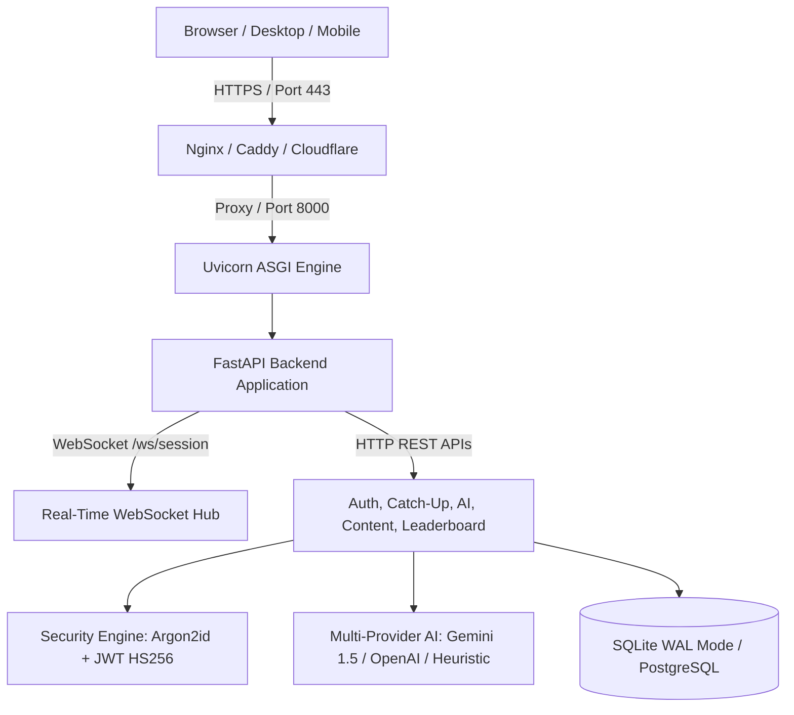

# 🚀 EduVault Platform — Production Deployment & Operations Guide

Welcome to the comprehensive production deployment handbook for **EduVault** — the enterprise-grade secure educational LMS platform featuring:
- **Instant Catch-Up & Session Continuity Engine** (Zero data loss on student network/power disconnects).
- **Enterprise Cryptography & Authentication** (Argon2id password hashing + cryptographically signed HMAC-SHA256 JWT tokens).
- **Multi-Provider AI Intelligence** (Google Gemini 1.5 Flash & OpenAI GPT-4o-mini with automatic local heuristic fallback).
- **Real WebRTC Audio/Video & Screen Sharing** (Camera, mic, active audio visualizer, screen capture, and DRM watermarking).
- **High-Concurrency Database** (SQLite with Write-Ahead Logging `WAL` mode and optional PostgreSQL/MySQL support via `DATABASE_URL`).
- **DevOps Ready** (Dockerfile, Docker Compose, Render Blueprint, and healthcheck monitoring).

---

## 📋 System Architecture



---

## ⚡ Quick Deployment Options

### Option 1: 1-Click Cloud Deploy via Render (Recommended)
EduVault includes a pre-configured `render.yaml` Blueprint file.

1. Push your repository to **GitHub** or **GitLab**.
2. Go to [Render Dashboard](https://dashboard.render.com/) and click **New + > Blueprint**.
3. Select your repository.
4. Render will read `render.yaml` and configure:
   - Python 3.13 web service.
   - Automatic dependency installation (`pip install -r requirements.txt`).
   - Secure auto-generated `SECRET_KEY`.
   - Healthcheck on `/api/health`.
5. *(Optional)* Add your `GEMINI_API_KEY` in the Render Environment Variables tab to enable Google Gemini 1.5 Flash.
6. Click **Apply** — your platform goes live with free automatic SSL (`https://your-app.onrender.com`).

---

### Option 2: Production Container with Docker & Docker Compose

EduVault is packaged with an optimized, non-root `Dockerfile` and `docker-compose.yml`.

#### 1. Configure Environment:
```bash
cp .env.example .env
```
Edit `.env` to configure your `SECRET_KEY` and any AI API keys.

#### 2. Build and Launch:
```bash
docker-compose up -d --build
```

#### 3. Verify Container Health:
```bash
docker-compose ps
# Healthcheck test:
curl -f http://localhost:8000/api/health
```

#### 4. Stop or Restart:
```bash
docker-compose down
docker-compose restart
```

---

### Option 3: Direct Linux Server / VM Deployment (Ubuntu / Debian / AWS EC2)

#### 1. System Packages:
```bash
sudo apt update && sudo apt install -y python3 python3-pip python3-venv git curl
```

#### 2. Clone Repository & Setup Virtual Environment:
```bash
cd /opt
sudo git clone <your-repo-url> eduvault
cd eduvault
python3 -m venv venv
source venv/bin/activate
pip install --upgrade pip
pip install -r requirements.txt
```

#### 3. Systemd Service Configuration:
Create `/etc/systemd/system/eduvault.service`:
```ini
[Unit]
Description=EduVault Platform ASGI Service
After=network.target

[Service]
User=www-data
Group=www-data
WorkingDirectory=/opt/eduvault
EnvironmentFile=/opt/eduvault/.env
ExecStart=/opt/eduvault/venv/bin/python run_server.py
Restart=always
RestartSec=5

[Install]
WantedBy=multi-user.target
```

Enable and start the service:
```bash
sudo systemctl daemon-reload
sudo systemctl enable eduvault
sudo systemctl start eduvault
sudo systemctl status eduvault
```

#### 4. Nginx Reverse Proxy with SSL (Let's Encrypt):
Create `/etc/nginx/sites-available/eduvault`:
```nginx
server {
    server_name yourdomain.com;

    location / {
        proxy_pass http://127.0.0.1:8000;
        proxy_http_version 1.1;
        proxy_set_header Upgrade $http_upgrade;
        proxy_set_header Connection "upgrade";
        proxy_set_header Host $host;
        proxy_set_header X-Real-IP $remote_addr;
        proxy_set_header X-Forwarded-For $proxy_add_x_forwarded_for;
        proxy_set_header X-Forwarded-Proto $scheme;
    }
}
```
Obtain free SSL certificate:
```bash
sudo apt install -y certbot python3-certbot-nginx
sudo certbot --nginx -d yourdomain.com
```

---

## 🔑 Environment Variables & AI Configuration

| Variable | Default Value | Description |
| :--- | :--- | :--- |
| `PORT` | `8000` | Port for the ASGI server to bind to. |
| `ENVIRONMENT` | `production` | `production` or `development`. Controls debug outputs. |
| `SECRET_KEY` | *(Set in .env)* | 256-bit cryptographically random key for JWT signing & Argon2 salting. |
| `DATABASE_URL` | `sqlite:///backend/eduvault.db` | Database connection URL. Default is high-concurrency SQLite with WAL mode. |
| `GEMINI_API_KEY` | *(Optional)* | Google Gemini 1.5 Flash API Key. Obtain from [Google AI Studio](https://aistudio.google.com/). |
| `OPENAI_API_KEY` | *(Optional)* | OpenAI GPT-4o-mini API Key. |
| `ALLOWED_ORIGINS` | `*` | Comma-separated list of allowed CORS domains in production. |

### How AI Fallback Operates:
1. **Google Gemini Active**: If `GEMINI_API_KEY` is present in `.env`, EduVault sends student catch-up requests and doubt queries directly to **Gemini 1.5 Flash** with low latency.
2. **OpenAI Active**: If `OPENAI_API_KEY` is set, it can query **GPT-4o-mini**.
3. **Zero-Key Offline Fallback**: If no API keys are provided, EduVault runs its internal **heuristic pedagogical synthesizer** — generating instant summaries, key takeaways, and answer explanations without failing or incurring external API bills.

---

## 🔒 Enterprise Security Hardening Checklist

- [x] **Argon2id Hashing**: Passwords stored as memory-hard Argon2id hashes with fallback to PBKDF2-HMAC-SHA256. Plaintext passwords never enter the database.
- [x] **JWT Auth Tokens**: HMAC-SHA256 signed tokens with client verification endpoint at `/api/auth/me`.
- [x] **DRM Watermarking**: Dynamic student ID watermark overlay in live sessions preventing unauthorized screen recording.
- [x] **SQL Injection Defense**: 100% parameterized SQL statements across all SQLite/PostgreSQL queries.
- [x] **CORS Protection**: Configurable allowed origin white-listing.
- [x] **WebSocket Disconnect Tracking**: Real-time heartbeat tracking with auto-generated catch-up timeline marker whenever a student drops offline.

---

## 🩺 Monitoring & Diagnostics

- **Health Check Endpoint**:
  ```bash
  curl -s http://127.0.0.1:8000/api/health | jq
  ```
  Returns `{"status": "online", "service": "EduVault Platform Backend", "database": "SQLite (eduvault.db)"}`.

- **Interactive API Swagger Docs**:
  Navigate to `http://127.0.0.1:8000/docs` to test all authentication, catch-up, leaderboard, and live class endpoints interactively.

- **Server Diagnostic Script**:
  Run the automated test suite locally:
  ```bash
  python test_backend.py
  ```
